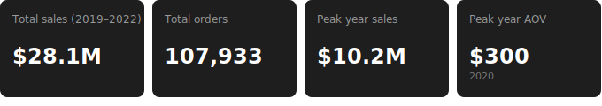

# GadgetGrid-E-Commerce-Performance-Analysis
Sales trend for ecommerce company

  

# Company Background
Founded in 2018, GadgetGrid is a global e-commerce company specializing in electronic products. Like most e-commerce companies, GadgetGrid sells products through their online site as well as through their mobile app. They leverage a variety of marketing channels to reach customers, such as Email campaigns, SEO, and affiliate links. Over the past few years, their more popular products have been products from Apple, Samsung, and ThinkPad. Since founding, GadgetGrid has grown to nearly 88,000 customers across 194 countries, generating over 108,000 transactions and approximately $28M in revenue.

To support strategic decisions across finance, sales, product, and marketing, transactional data spanning 2019–2022 was analyzed to surface insights into revenue trends, product performance, and customer purchasing behavior.

## North Star Metric
GadgetGrid's primary measure of success is <b> total revenue </b> in USD. Supporting metrics include:
<li> <b>Order Volume</b> - total transactions placed. </li>
<li> <b>Average Order Value</b> - proportion of orders with a recorded return, serving as a customer satisfaction and product quality signal </li>
<li> <b>Time to Ship / Deliver</b> - derived from purchase date, ship date, and deliver date, reflecting operational efficiency. </li>

## Areas of Analysis
<li> <b> Sales Trends </b> - Examining revenue, order volume, and average order value (AOV) across 2019-2022 to identify growth patterns and post-pandemic demand shifts. </li>
<li> <b> Product Performance </b> - Analyzing performance across the core product catalog to understand which products drive the most revenue and where refund rates are highest. </li>
<li> <b> Geographical Performance </b> - Evaluating purchasing behavior across 194 countries to surface regional demand patterns and opportunities for improvement. </li>
<li> <b> Loyalty Program </b> - Program adoption, member vs. non-member purchasing behavior and retention analysis. </li>
<li> <b> Marketing Channel Effectiveness </b> - Channel contribution to revenue, growth trends, and performance by acquisition source. </li>
 

  
Table of Content

 

# Overview
## Executive Summary

## Dataset Structure

# Deep Dive Insights
## Sales Trends

- <b> Pre-COVID (2019) </b>: Established baseline of $3.9M in sales across 16.8K orders with an AOV of $230.
- <b> COVID (2020) </b>: Order volume doubled to 33.8K with AOV peaking at $300, reflecting a shift towards higher-ticket purchases.
- <b> Post-COVID (2021-2022) </b>: While sales in 2021 remained high, there was a steady decline with an AOV of $255. In 2022, sales declined 52% from peak, normalizing towards pre-pandemic levels with $5M in sales and an AOV of $230.   

## Seasonality Trends
- Best Perfoming Months: September, November, and December are consistently strong performing.
- December was the highest performing month across all four years, likely driven by holiday gift purchasing. December 2020 was the single highest-revenue month in the dataset at $1.25M which is roughly 3x the December 2019 figure.
- A secondary mid-year peak was observed in September-OCtober across 2020-2021, potentially signfying back to school and early procurement. This pattern is consistent with product mixture (laptop, monitor, headphones) which skews towards academic and professional usage. 
- Worst Performing Months: Feburary is around the lowest or near lowest every year, suggesting a post-holiday hangover. 

## Product Trends
- <b> Best Performing Products </b>: The 27in 4K Monitor and AirPods were the top two products by sales, generating $9.9M and $7.7M respectively and together accounting for ~63% of total sales across 2019-2022.
- <b> Order Volume </b>: AirPods led in terms of order volume with 48K in units, reflecting strong mid-price point demand; the 27in 4K Monitor led in sales value despite lower order volume of 23K units.
- <b> Covid Driven Sales </b>: MacBook Air and ThinkPad saw the sharpest COVID driven sales spikes in 2020, consistent with remote work and learning demand. MacBook Air jumped from $607K in 2019 to $2.9M in 2020. Additionally, Samsung Webcam was not present in 2019 catalog, but grew steadily through 2021 ($171K), which further supports the WFH narrative.

### Refund Rates
- <b> Highest Refund Rate </b>: MacBook Air and ThinkPad carried the highest refund rates at 11% and 12%, suggesting a product quality or customer expectation mismatch - notably after their large sales spikes during the pandemic when demand was high and potentially impulse driven.
- <b> Highest Refund Volume </b>: AirPods had the highest refund volume at 2.6K units, followed by the 27in 4K gaming monitor at 1.4K units.
- <b> Lowest Refund Volume </b>: Samsung Cable had the cleanest refund rate at 2.4% which is consistent with low-complexity and low-price-point, carrying a lower return risk. 

## Geographical Performance

- <b> Top Performing Region</b>: North America was the top region by sales at $14.6M across 56K orders.
- <b> Top Performing Country</b>: The US was the dominant market by a significant margin, generating $13.3M in sales, which accounts for 47% of total sales across 2019-2022. It's also more than 6x the next highest country (GB at $2.1M).
- <b> Smallest Performing Region</b>: LATAM was the smallest region by sales but showed proportional growth during 2020 which was consistent with other regions. It suggests that baseline demand exists and could be further developed with region specific marketing or pricing strategies.

 

## Loyalty Program

- <b> Growth</b>: Loyalty program membership grew substantially over the four-year period, from just 12% of total orders in 2019 to 52% by 2022. Member order volume grew 6.5x from 2K in 2019 to 13K in 2020.
- <b> AOV Shift</b>:In the early years (2019–2020), non-members outspent members on a per-order basis — non-member AOV peaked at $346 in 2020 compared to $228 for members, indicating the program was not yet driving higher-value purchases. By 2022, the dynamic had flipped — member AOV ($245) surpassed non-member AOV ($215) for the first time, suggesting the program began attracting or retaining higher-value customers as it matured.
- <b> Sales Composition</b>:Non-member sales dominated total sales through 2020 ($7.2M vs $3.0M for members) but member sales overtook non-members by 2021 ($4.9M vs $4.3M), marking a structural shift in where revenue was coming from.

# Recommendations
